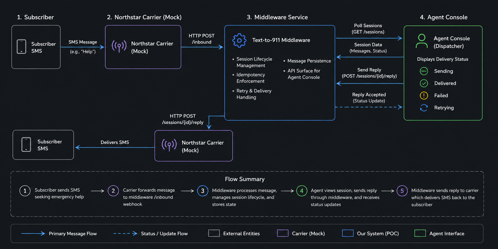

# Northstar Text-to-911 — Middleware & Agent Console (POC)

Proof-of-concept for the **RapidSOS Forward Deployed Engineer** exercise: a carrier-integrated middleware layer between **Northstar Telecom** (SMS) and a **911 agent console**, with session lifecycle, idempotency, outbound retries, and a runnable demo harness.

**Stack:** Python 3.10+, FastAPI, in-memory store, vanilla JS console (no build step).

---

## Quick start (presentation)

From the repo root:

```bash
python -m venv venv
pip install -r requirements.txt
```

**PowerShell:** `.\venv\Scripts\Activate.ps1`  
**Linux / macOS:** `source venv/bin/activate`

**Terminal 1 — start services**

```bash
python run.py
```

Starts **mock Northstar** on `:8001` and **middleware + console** on `:8000`. Open the agent UI:

**[http://127.0.0.1:8000/console/](http://127.0.0.1:8000/console/)**

**Terminal 2 — run the harness**

```bash
python harness/simulate.py
```

Eleven scripted caller scenarios launch **staggered over the first five minutes** (parallel threads). Watch the sidebar fill in and step through conversations as messages arrive.

**Tests (optional before the demo):**

```bash
python -m pytest tests
```

Use `python -m pytest` (not bare `pytest`) from the repo root so `middleware` imports resolve.

---

## What this POC delivers (case study mapping)


| Requirement                     | Implementation                                                                                    |
| ------------------------------- | ------------------------------------------------------------------------------------------------- |
| `POST /inbound` from Northstar  | `middleware/app/routes/webhooks.py` → `services/inbound.py`                                       |
| `GET /sessions` for the UI      | `GET /sessions?group_by_phone=true` (one row per caller); flat list + `include_expired` for tools |
| `GET /sessions/{id}`            | Full thread + `previous_sessions` for same phone                                                  |
| `POST /sessions/{id}/reply`     | Calls mock Northstar outbound API with retries                                                    |
| Session TTL (5 min inactivity)  | `shared/session_policy.py` + lazy expiry on read                                                  |
| Reject reply on expired session | HTTP **409** `SESSION_EXPIRED`                                                                    |
| Inbound idempotency             | Dedup key: `phone                                                                                 |
| Outbound failure handling       | Retries, persisted `delivery_status` on message, UI banner + feedback                             |
| Mock Northstar outbound         | `mock_northstar/app/main.py` — `FORCE_FAIL` in text → HTTP 500                                    |
| Agent console                   | Static app at `/console` — poll every 2s, expiry UX, reply feedback                               |
| Test harness                    | `harness/simulate.py` — 11 scenarios (happy path, expiry, dedup, parallel callers, etc.)          |
| In-memory only                  | Documented below; restart clears state                                                            |
| No auth / no prod deploy        | Out of scope by design                                                                            |


### POC Enhancements (**judgment calls, not required by the brief):**

These additions prioritize operator clarity, lifecycle visibility, and deterministic demo behavior.

#### Agent Console UX

- Sidebar grouped by caller instead of raw session id
- Filters for status, unread state, and deployed agency
- Unread indicators for inbound messages awaiting response
- Active / expiring / expired lifecycle visibility with countdown timers
- Reply disabled on expired sessions with backend 409 enforcement
- Delivery states surfaced directly in the UI (sending, delivered, failed)

#### Session Continuity

- Previous sessions for the same caller rendered inline above the current session
- Context banners indicating rollover boundaries and non-current sessions
- Sidebar automatically follows the current active session for repeat callers

#### Agency Deployment

- FIRE / MEDICAL / POLICE tagging and filtering
- Historical deployment visibility preserved across prior sessions

#### Reliability and Lifecycle Behavior

- Inbound idempotency for duplicate carrier delivery protection
- Outbound idempotency to prevent duplicate agent sends
- Deterministic outbound failure simulation and retry handling
- Shared frontend/backend session expiration policy

---

## Architecture



**Process layout**


| Component                  | Role                                                                                          |
| -------------------------- | --------------------------------------------------------------------------------------------- |
| `middleware/`              | Session store, inbound/outbound services, agent + webhook routes, serves console static files |
| `mock_northstar/`          | Stub carrier outbound API (`POST /messages`, `GET /health`)                                   |
| `console/`                 | Agent UI — `app.js` + `session-ui.js` (expiry/delivery helpers)                               |
| `harness/simulate.py`      | Scripted citizen + dispatcher traffic for live demo                                           |
| `shared/session_policy.py` | TTL constants and shared expiry math (middleware + console via `/config`)                     |
| `run.py`                   | Spawns uvicorn for mock + middleware; health-check gate before demo                           |


**Code layout**

```
northstar/
├── shared/session_policy.py
├── middleware/app/
│   ├── main.py              # FastAPI app, mounts /console
│   ├── config.py            # Settings (TTL, retries, Northstar URL)
│   ├── models.py            # Pydantic API + domain models
│   ├── store.py             # In-memory sessions + idempotency caches
│   ├── routes/
│   │   ├── webhooks.py      # POST /inbound
│   │   └── agent.py         # /config, /sessions, reply, tags
│   └── services/
│       ├── inbound.py
│       ├── sessions.py
│       └── outbound.py
├── mock_northstar/app/main.py
├── console/                 # index.html, app.js, session-ui.js, style.css
├── harness/simulate.py
├── run.py
└── tests/
```

---

## Design decisions (ambiguity from the brief)

These are the tradeoffs we’d defend in a carrier working session.

### Session lifecycle

- **TTL:** 5 minutes since `last_activity_at` (inbound or outbound refreshes activity). Defaults live in `shared/session_policy.py` (`SESSION_TTL_SECONDS = 300`).
- **Expiry is lazy:** Sessions are marked `expired` when read (list/detail/reply), not by a background job — fine for a POC; production would use a scheduler or TTL index.
- **User texts after expiry:** Opens a **new session** (new UUID). Prior sessions remain in the store for history; the phone pointer (`sessions_by_phone`) moves to the active session.
- **User texts during “expiring soon”:** Still the **same session** — activity extends TTL. The console shows **Expiring Soon** when remaining time < `session_expiring_soon_seconds` (default 120s).

### Agent visibility of expired sessions

- **Sidebar:** `GET /sessions?group_by_phone=true` includes callers with expired current sessions (status + expiry UI) so agents see context; reply is disabled when not `is_reply_target` or when expired.
- **Conversation panel:** `GET /sessions/{id}` returns `previous_sessions` for older threads on the same number — history without a separate “archive” API.

### Inbound idempotency

- Key: normalized `from + text + timestamp`. Duplicate Northstar deliveries return the same `session_id` / `message_id` with `duplicate: true` and do not append twice.

### Outbound failures and retries

- **Policy:** Up to **4 attempts** (initial + 3 retries), backoffs **0.5s, 1s, 2s** (`middleware/app/config.py`). HTTP **4xx** from mock Northstar is **not** retried; **5xx** and network errors are.
- **Agent experience:** Outbound is stored on the session immediately; delivery result is written on the message (`delivery_status`, `delivery_error`, `delivery_attempts`). The console shows **FAILED** / a system banner; failed messages stay in-thread with “Not delivered to caller.”
- **Deterministic demo failure:** Reply text containing `**FORCE_FAIL`** makes mock Northstar return HTTP 500 (harness scenario 8).

### Outbound idempotency (POC extra)

- Same `session_id`, `text`, and optional agent `timestamp` → `duplicate: true` on replay (Northstar or UI double-submit).

### Concurrency

- A single `asyncio.Lock` on the in-memory store serializes mutations; outbound HTTP runs **outside** the lock so retries do not block inbound on other sessions.

### Storage

- **In-memory only** — fast to ship, easy to demo; **all state is lost on restart**. Called out explicitly for production planning.

---

## API reference

Base URL: `http://127.0.0.1:8000`

### Northstar → middleware


| Method | Path       | Body / notes                                                                                        |
| ------ | ---------- | --------------------------------------------------------------------------------------------------- |
| `POST` | `/inbound` | `{ "from": "+1…", "text": "…", "timestamp": "ISO-8601" }` → `{ session_id, message_id, duplicate }` |


### Agent console → middleware


| Method  | Path                             | Purpose                                                                         |
| ------- | -------------------------------- | ------------------------------------------------------------------------------- |
| `GET`   | `/config`                        | `session_ttl_seconds`, `session_expiring_soon_seconds`                          |
| `GET`   | `/sessions?group_by_phone=true`  | Sidebar: one row per caller (`PhoneSummary`)                                    |
| `GET`   | `/sessions?include_expired=true` | Flat per-session list (debug/tools)                                             |
| `GET`   | `/sessions/{id}`                 | Thread + `previous_sessions`, `is_reply_target`, delivery fields                |
| `PATCH` | `/sessions/{id}/tags`            | Agency tags: `fire`, `medical`, `police` (current session only)                 |
| `POST`  | `/sessions/{id}/reply`           | `{ "text", "timestamp"? }` → `{ success, error, delivery_attempts, duplicate }` |
|         |                                  | Expired session → **409** `{ "code": "SESSION_EXPIRED", "message": "…" }`       |


### Middleware → mock Northstar


| Method | Path                             | Default                          |
| ------ | -------------------------------- | -------------------------------- |
| `POST` | `http://127.0.0.1:8001/messages` | `{ to, from, text, session_id }` |


Interactive docs: **[http://127.0.0.1:8000/docs](http://127.0.0.1:8000/docs)**

---

## Agent console

- **Polling:** `GET /sessions?group_by_phone=true` and `GET /sessions/{id}` every **2 seconds** (pauses when the tab is hidden).
- **Sidebar:** Status dot (active / expiring soon / expired), preview, unread indicator, filters (status, read, agency).
- **Conversation:** Historical sessions above the current thread; expiry countdown; reply bar with send feedback and agency tag checkboxes.
- **Expiry UX:** Mirrors server rules using `/config`; replies disabled when expired or viewing a non-current session.

Pure UI helpers live in `console/session-ui.js` (tested indirectly via `tests/test_console_api_contract.py` on the middleware contract).

---

## Harness scenarios

`python harness/simulate.py` — requires `python run.py` already up.


| #   | Title              | What it demonstrates                                            |
| --- | ------------------ | --------------------------------------------------------------- |
| 1   | Happy path         | Fire emergency, dispatch, resolution, **new session after TTL** |
| 2   | Expired session    | No citizen reply; **409** on agent reply after TTL              |
| 3   | Duplicate outbound | Same timestamp replay → idempotent                              |
| 4   | Police break-in    | Urgent police flow                                              |
| 5   | Multi-agency       | Police + medical same incident                                  |
| 6   | Medical chest pain | Medical dispatch                                                |
| 7   | Fire smoke alarm   | Fire + post-TTL follow-up                                       |
| 8   | Outbound failure   | `FORCE_FAIL` → retry → success                                  |
| 9   | Fire and medical   | Dual tags                                                       |
| 10  | Expiring soon      | Citizen returns near end of window                              |
| 11  | Session rollover   | Thank-you after TTL → new session                               |


Scenarios start **staggered over ~5 minutes** so the console is not overwhelmed at t=0.

---

## Tests

```bash
python -m pytest tests -q
```


| Area                         | Files                                                                                                                               |
| ---------------------------- | ----------------------------------------------------------------------------------------------------------------------------------- |
| Inbound / sessions           | `test_inbound_concurrent.py`, `test_session_history.py`, `test_last_inbound_at.py`                                                  |
| Outbound                     | `test_outbound_retry_backoff.py`, `test_outbound_delivery_failure.py`, `test_outbound_idempotency.py`, `test_duplicate_outbound.py` |
| Agent API / console contract | `test_console_api_contract.py`, `test_phone_summary_last_message.py`, `test_session_tags.py`                                        |
| Mock Northstar               | `test_mock_northstar.py`                                                                                                            |


---

## Production: what we’d add next

1. **Device geolocation metadata** to improve caller routing and dispatch awareness.
2. **AI-assisted summaries** of prior sessions to improve repeat-caller continuity and reduce operator cognitive load.
3. **Reporting and analytics exports** for session metrics, agency activity, operator workflows, and date-range reporting.
4. **Persistent storage** using Postgres/Dynamo with phone + session indexes and idempotency keys as unique constraints.
5. **Authentication** with mTLS or signed webhooks from Northstar and agent SSO for the console.
6. **Background expiry and metrics** for session age, delivery latency, and retry counts.
7. **Real-time push** using SSE/WebSockets instead of 2-second polling.
8. **Observability** with structured logs, trace IDs across inbound → outbound, and PSAP operations dashboards.
9. **Tenant-specific configuration** for TTL, retry policy, and short codes.
10. **HA deployment** with stateless middleware replicas and external session storage.

---

## AI tooling

Built with AI-assisted development (e.g. Cursor). Architectural choices above are intentional and reviewable in:

- `middleware/app/services/sessions.py` — expiry, grouping, history
- `middleware/app/services/inbound.py` / `outbound.py` — idempotency and retries
- `console/session-ui.js` — client-side expiry alignment with `/config`

For the presentation: we can walk any of these files and tie behavior back to carrier requirements and failure modes.

---

## Troubleshooting


| Symptom                        | Fix                                                                                                                                 |
| ------------------------------ | ----------------------------------------------------------------------------------------------------------------------------------- |
| `No module named 'middleware'` | Run pytest from repo root: `python -m pytest tests`                                                                                 |
| Console empty / errors         | Ensure `python run.py` is running; open **[http://127.0.0.1:8000/console/](http://127.0.0.1:8000/console/)** (not a `file://` path) |
| Harness exits immediately      | Start services first; harness checks `/health` on :8000 and :8001                                                                   |
| Port in use                    | Stop other uvicorn instances on 8000/8001                                                                                           |


---

## License / context

Exercise submission for RapidSOS Forward Deployed Engineer case study (2026). Not production software — demo and design discussion artifact.